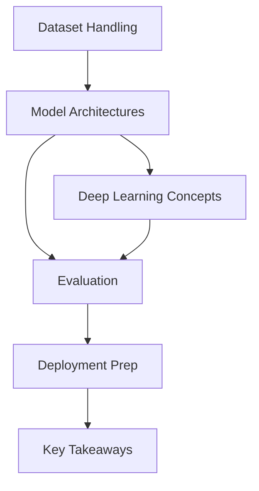

# 🧠 CIFAR-10 Image Classification with CNNs

This project demonstrates **image classification** on the [CIFAR-10 dataset](https://www.cs.toronto.edu/~kriz/cifar.html) using **Convolutional Neural Networks (CNNs)**.  
You will learn how CNNs outperform traditional Fully Connected Neural Networks (FCNNs) for image tasks.

---

## 📌 Dataset
- **CIFAR-10**: 60,000 32x32 color images in 10 classes
- Training: 50,000 images  
- Testing: 10,000 images  
- Classes: `airplane, car, bird, cat, deer, dog, frog, horse, ship, truck`

---

## 🚀 Concepts Learned
1. **Data Handling**
   - Loading & normalizing CIFAR-10
   - Visualizing random samples
   - Inspecting dataset shape

2. **Model Architectures**
   - Baseline **Fully Connected Neural Network (FCNN)**
   - Simple **Convolutional Neural Network (CNN)**
   - Improved CNN with **Batch Normalization** & **Dropout**

3. **Deep Learning Concepts**
   - Convolution layers for feature extraction  
   - Pooling for spatial reduction  
   - Batch Normalization for stable training  
   - Dropout for regularization

4. **Evaluation**
   - Model accuracy on train & test sets  
   - Confusion Matrix & Classification Report  
   - Visualizing misclassified samples  

5. **Deployment Prep**
   - Saving & loading trained model  
   - Testing predictions on unseen images  

---

## 📊 Results
- FCNN Test Accuracy: ~45%  
- Basic CNN Test Accuracy: ~70%  
- Improved CNN Test Accuracy: **80–85%**

✔️ Clear improvement shows **CNNs are better suited for image classification** than FCNNs.  

---

## 🖼 Workflow Summary



---

## 💻 How to Run
```bash
# Clone the repo
git clone https://github.com/shalinisaurav/cifar10-cnn.git
cd cifar10-cnn

# Install dependencies
pip install tensorflow matplotlib numpy scikit-learn

# Run training
python cifar10_cnn.py
```

---
## 👩‍💻 AUTHOR :
    SHALINI SAURAV

## 📌 Future Work
- Add **data augmentation** to improve generalization  
- Experiment with **ResNet / VGG pretrained models**  
- Deploy using **Streamlit / Flask** web app  

---

## 🧠 Key Takeaways
- CNNs extract spatial features, making them **superior to FCNNs** for images.  
- Batch Normalization & Dropout improve model **stability and generalization**.  
- This project is a **foundation for advanced computer vision tasks** like transfer learning.  

---
